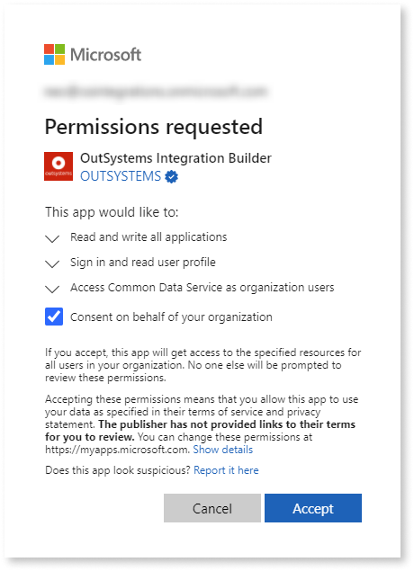

# Microsoft Dynamics 365 integration

The Microsoft Dynamics 365 integration allows you to perform operations on entities available in Microsoft Dynamics 365 from your OutSystems applications.

## Prerequisites

* Make sure you meet the general [Integration Builder prerequisites](../set-up.md#prerequisites).
* The Microsoft Dynamics 365 integration deployed in your OutSystems development environment can make HTTPS outbound requests (port 443) to your Microsoft Dynamics 365 service.
* You have a Microsoft account with Microsoft Dynamics 365 and Azure Administrator privileges. These admin privileges are required to access your Azure Active Directory tenant and to create security roles and application users.

## Authorizing Integration Builder in your Microsoft account

Follow the instructions provided in [Creating and using an integration](../use.md#create-use). You must authorize Integration Builder to access your data in Microsoft Dynamics 365 through your Microsoft account.

Integration Builder uses this authorization to obtain the available objects for building a Microsoft Dynamics 365 integration.

Additionally, when you're creating a connection, Integration Manager connects to Integration Builder, requesting the creation of an Azure app and other related objects. This operation uses the same authorization, since only Integration Builder has the access tokens for this authorization.

### About environment instances

If you have several Microsoft Dynamics 365 environment instances in your Microsoft account, Integration Builder will ask you which environment you want to use when connecting to Microsoft Dynamics 365.

According to Microsoft, an environment instance in Microsoft Dynamics 365 is "a space to store, manage, and share your organization's business data, apps, and flows". When you're creating a Microsoft Dynamics 365 integration, Integration Builder registers an Azure application in the environment you choose.

## Authorizing a Microsoft Dynamics 365 connection

Microsoft Dynamics 365 integrations generated with Integration Builder use a certificate to authenticate requests done at runtime, using the connection you configured.

Integration Builder registers an app with Azure AD at the request of Integration Manager. When you create a connection, Integration Manager requests Integration Builder to create and associate a certificate with this app, saving the certificate details in an encrypted way as part of the connection information.

Request authentication is handled transparently when you call Server Actions exposed by the service module (the module with a "_IS" suffix, by default). The Server Actions obtain the certificate info from the connection that you previously associated with the integration in Integration Manager. Therefore, you don't need to provide any authentication information as input parameters.

### Editing a connection in Integration Manager

Each connection to Microsoft Dynamics 365 you create in Integration Manager is tied to an application registered in Azure AD. To edit the connection, you must use a Microsoft account that has access to Azure AD and must authorize Integration Builder to connect on this user's behalf.

This authorization is only valid for a specific user. If another user wants to edit a connection or integration, they also need to authorize Integration Builder.
